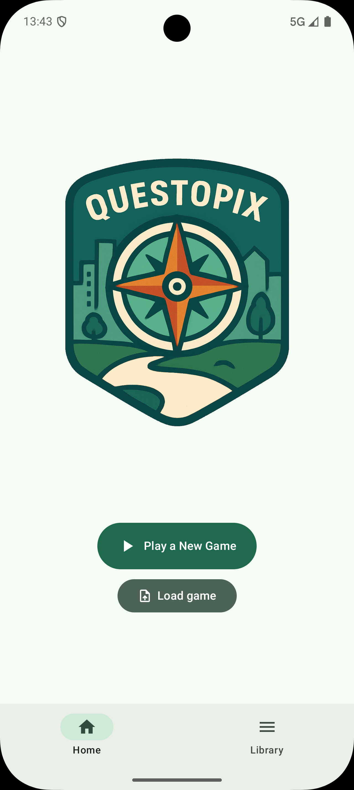
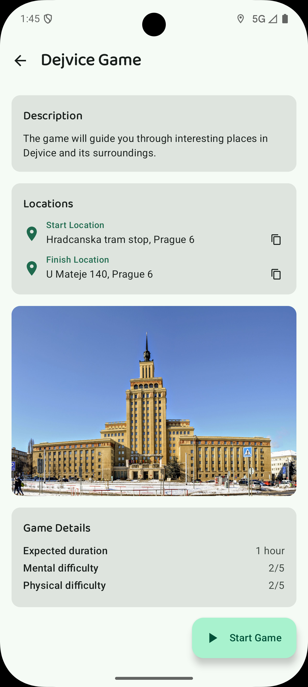
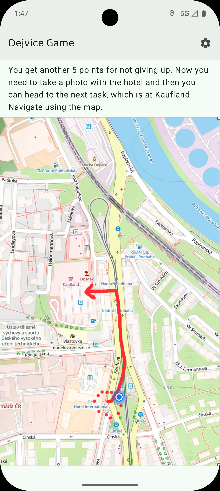

# Questopix

An Android app for playing GPS-based outdoor games like treasure hunts and scavenger hunts. Create your own games in JavaScript, package them as ZIP files, and play them anywhere.

<p align="center">
  
  
  
</p>

## Features

- Play outdoor GPS-based games with tasks like answering questions, taking photos, or visiting locations
- Import custom games from ZIP files
- Save and resume game progress
- Works offline once games are downloaded

## Creating Your Own Game

Want to create your own outdoor adventure? Check out the documentation:

- [Getting Started Guide](docs/GettingStarted.md) - Step-by-step tutorial for creating your first game
- [Game Format Specification](docs/GameFormatSpecification.md) - Complete API reference, licensed under [MIT](docs/LICENSE-MIT.md)

## Installation

Download the latest APK from the [Releases](https://github.com/rjnk/questopix-android/releases) page. Android 10+ required.

## Building from Source

```bash
# Build debug APK
./gradlew assembleDebug

# Install to connected device
./gradlew installDebug
```

## Contributing

Pull requests are welcome! Whether it's bug fixes, new features, documentation improvements, or new game examples - all contributions are appreciated.

## License

The Questopix Android application is licensed under the [GPL-3.0](LICENSE).

The game format, as specified in the [Game Format Specification](docs/GameFormatSpecification.md), is licensed under the [MIT License](docs/LICENSE-MIT.md).
